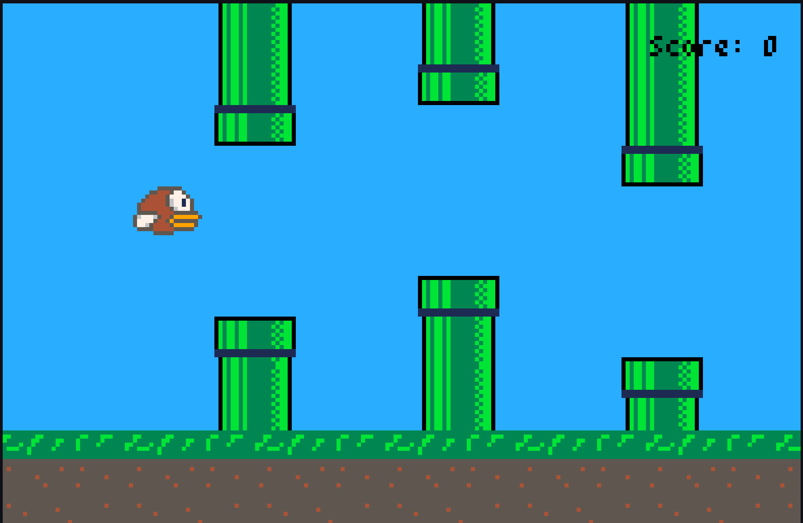

# Flappy Bird

This is a new one Flappy Bird game copy created with python library `Pyxel`

### Installation

Firstly, you need to install python 3.x. The tested `Pyxel` versions is 1.1.0-1.2.9. To install tested version:

    pip install pyxel==1.1.0
    
(latest versions 1.3.x works too, but color pallete is different)

Then, for playing game, type:

    python main.py  
    
Controls:

- `R` - restart game
- `Space` or `Up` keys - flappy bird up movement
- `Alt+F4` - close game
